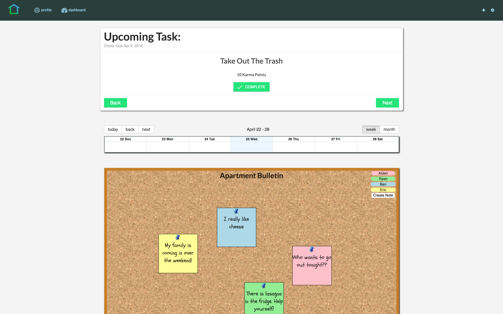
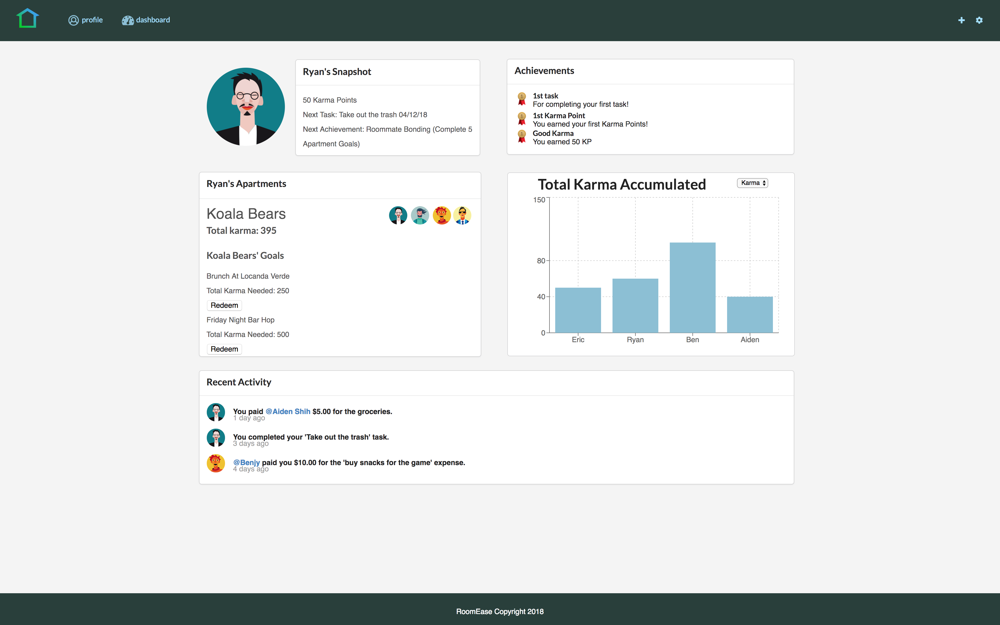

# RoomEase

A web application for roommates to manage their apartment by adding and completing tasks, expenses and chores for karma points which can be redeemed for group chosen goals.

## Dashboard


## Profile


## Install npm packages and seed database:

```
cd backend
yarn install
cd db
cd sql
psql -f roomEase.sql
psql -f seed_data.sql
cd ..
cd ..
yarn start
cd ..
cd frontend
yarn install
yarn start
```

## user login: 

### username:
```
ryry
```
### password:
```
Password123
```

## created by:
- Aiden Shih
- Eric Liu
- Ruben Profit
- Ryan Omoruyi

## RoomEase©